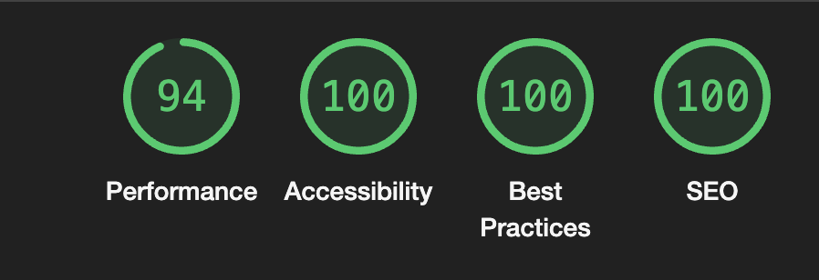
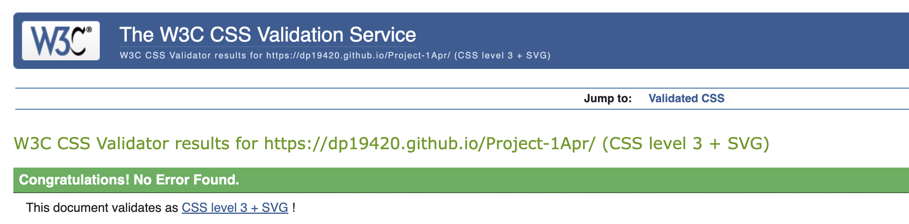

# Daniel Pagard

## A website presenting the concept of me to the wider world.  

Welcome to my README.md file, it belongs with a page making a short introduction of me, with text on the front page, a music video on the Media page and links to my GitHub and LinkedIn on the links page.

Why have i created this site?

**For 2 reasons:**

 - To annonce the start of my programming journey to the GitHub Community

 - To enter as my first project to the [Code Institute](https://codeinstitute.net/se/?nab=1)
 

## Features

### Existing Features:

**Navigation Bar**

- Featured on all pages, with links to Home, Media and Links pages.
- Becomes a dropdown menu on smaller screen widths.

**Video**

- iframe embedded youtube video of a music school project i did a couple of years ago
- iframe changes dimensions according to screen width

## Testing
I have tested the links and screen size adjustments on google chrome on pc and android.

Running it throu Lighthouse in the Google Devs tools to check acessability score.

**Validator Testing**

- HTML code tested via [W3 HTML Validator](https://validator.w3.org/)
+ Home

+ Media

+ Links

- CSS code tested and clear via [W3 CSS Validator](https://jigsaw.w3.org/css-validator/)
+ CSS

## Deployment

## Credits

### Media

- Images and video belongs to me.
- Favicon generated with  adrian17's [Gallifreyan translator](https://adrian17.github.io/Gallifreyan/) and iconpack generated with [Real Favicon Generator](https://realfavicongenerator.net/)

### Code

- Navigation bar and Hero image coded with help of Love Running Walkthrou project.
- Favicon code generated and copied from [Real Favicon Generator](https://realfavicongenerator.net/)